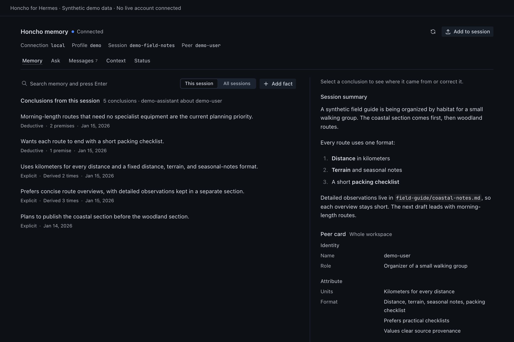

# Honcho Memory for Hermes


A Hermes Desktop plugin for the [Honcho](https://honcho.dev) memory behind the
chat you are looking at. Read what Honcho concluded, see where each conclusion
came from, search what was said, ask a question, and correct memory that is
wrong, without leaving the conversation.

This is an independent community plugin. It is not affiliated with, or
endorsed by, Nous Research or Plastic Labs.

It opens as a page from the sidebar (**Honcho**) and as a **Honcho Memory**
pane docked beside the chat. A status-bar item shows whether Honcho is
reachable and whether background reasoning is still running.



## What it shows

- **Memory**: the session's conclusions, newest first, with semantic search and
  a switch between this session and all sessions. Select a conclusion to see its
  premises, what was derived from it, and where it was recorded.
- **Ask**: asks Honcho a question about the user, scoped to this session or all
  sessions, at the reasoning effort you choose. On supported servers it lists the
  records Honcho read. Reading a record is not proof that it supports the answer.
- **Messages**: saved messages for the session, grouped by day and rendered as
  they appear in chat, plus Honcho search across the session, the user, the
  whole workspace, or a named Honcho scope.
- **Context**: what Honcho would supply right now at a token budget you pick:
  the session summary, what Honcho knows in this session and across sessions,
  the peer card, and the recent messages. This is a fresh build, not a record of
  what an earlier reply received.
- **Status**: the connection, profile, Honcho session, mapping, configuration,
  and background-reasoning queues for this chat.

A Honcho session can span several Hermes chats, for example when sessions are
mapped per repository. The header shows the connection, profile, Honcho session,
and peer, so it is always clear whose memory you are reading.

## Changing memory

Two actions write to Honcho. Both ask you to confirm the exact target first.

- **Add fact** and **Add correction** add one explicit conclusion about the
  user, attributed to the current Honcho session. Nothing is deleted or
  overwritten, and derived memory may take a while to catch up. The plugin reads
  the saved text back before reporting success.
- **Add to session** sends pasted text or a PDF, JSON, or text file into the
  current session. Honcho may split it into several messages, and each one is
  read back by ID.

If a response is lost, the outcome is reported as unknown and the action is not
retried. Check Memory or Messages before trying again.

## Profiles and connections

The plugin follows the chat in focus. With the sidebar showing every profile, a
chat from another profile on the same connection is read in that profile, using
that profile's own Honcho configuration. A chat that lives on a different
connection than the active one, or whose owner Hermes cannot determine, is
shown as blocked with the reason. It is never read through another profile.

Remote SSH and gateway connections work the same way when the plugin's backend
is installed on the remote profile. See [Windows and SSH testing](docs/windows-ssh-testing.md).

## Requirements

- Hermes 0.21.4 or newer, with Hermes Desktop.
- The Honcho memory provider installed and configured in each profile you want
  to inspect:

  ```sh
  hermes plugins install honcho
  hermes memory setup honcho
  ```

- The Python `honcho-ai` SDK that the provider installs. The plugin is tested
  with 2.2.0, 2.4.0, 2.5.0, and 2.5.1. Premises, derived conclusions, and the
  records list in Ask need SDK 2.5 and a Honcho 3.2 or newer server. Features
  the selected server does not support are shown as unavailable, not as empty.

## Install

```sh
hermes plugins install outpoints/hermes-honcho-plugin --enable
```

The page and pane are added once, on the machine running Hermes Desktop. The
backend must be installed and enabled in every profile you want to read,
including profiles on remote hosts:

```sh
hermes -p <profile> plugins install outpoints/hermes-honcho-plugin --enable
```

Restart Hermes after installing so each profile's backend loads the plugin. If
**Honcho** does not appear in the sidebar, turn it on in **Settings → Plugins**.

## What it reads and sends

- Requests go only to the Honcho server each profile is already configured to
  use, through that profile's Honcho provider. The plugin has no telemetry and
  makes no other network calls.
- It reads the focused chat's title and working directory from that profile's
  Hermes session database, read-only, to find the Honcho session.
- It never reads, returns, or stores Honcho credentials. Hermes resolves them.
- Reads never create Honcho workspaces, sessions, peers, or scopes.
- **Ask** starts a reasoning call on your Honcho server, which may use credits.
  Nothing runs until you ask.
- Writes happen only through the two confirmed actions above.

## Limits

- Honcho's default upload limit is 5 MiB. Self-hosted servers can set another
  value, and the server makes the final call. The plugin adds no limit of its own.
- Hermes cannot forward file uploads to OAuth-protected remote gateways yet.
  Uploads to those fail with an error instead of going anywhere else.
- Confirmation tickets live in the backend process for two minutes. Restarting
  Hermes in between means confirming again.
- Exact per-reply recall, service-wide queue metrics, and fleet administration
  are out of scope.

## Troubleshooting

| What you see | What to do |
| --- | --- |
| Can't reach the Honcho plugin | Enable `hermes-honcho-plugin` in that profile and restart Hermes. |
| Honcho isn't set up for this profile | Run `hermes -p <profile> memory setup honcho`. |
| No Honcho session for this chat | The chat is a new draft. Send a message, or open a saved chat. |
| This chat isn't in Honcho yet | Hermes saves the session after the first message. |
| This chat is on another connection | Switch Hermes to that connection to read it. |
| Partial | One Honcho read failed. Status lists which one. The rest still updates. |

## Development

The Desktop file `desktop/plugin.js` is plain ESM that Hermes loads without a
build step. The backend is `dashboard/plugin_api.py`, a FastAPI router that uses
the installed Honcho provider and SDK.

```sh
./scripts/check.sh                 # JavaScript and Python tests
hermes plugins validate . --json
hermes plugins doctor --ci .
```

These need a Hermes source checkout with Desktop built
(`HERMES_SOURCE=/path/to/hermes-agent`):

```sh
node scripts/check-ui-surface.mjs   # SDK imports and shipped CSS classes exist in the host
node scripts/check-host.mjs         # real host REST bridge and profile routing, offline
node scripts/screenshots.mjs        # synthetic-data screenshots and accessibility checks
node scripts/catalog-art.mjs        # catalog banner and gallery
```

`check-host.mjs` and `screenshots.mjs` also need `SCREENSHOT_WORK_DIR` set to a
scratch directory. Every screenshot uses invented demonstration data.

More detail: [architecture](docs/architecture.md),
[compatibility](docs/compatibility.md),
[release verification](docs/release-readiness.md),
[screenshots](docs/screenshots/README.md),
[catalog submission](docs/catalogue.md).

## Affiliation and trademarks

Honcho Memory for Hermes is an independent, community-made project. It is not
affiliated with, endorsed by, sponsored by or supported by Nous Research or
Plastic Labs.

"Hermes", "Hermes Agent", "Nous Research" and the Nous Girl character are
trademarks or brand assets of Nous Research. "Honcho" is a product of Plastic
Labs. These names appear here only to say what the plugin works with.

The catalog images show new, AI-generated drawings of the Nous Girl, made with
her MIT-licensed mark from hermes-agent as a reference. The prompts and the
license notice are in [docs/catalog/art](docs/catalog/art/README.md).

## License

GPL-3.0. See [LICENSE](LICENSE). It grants no rights to the names or marks
above.
